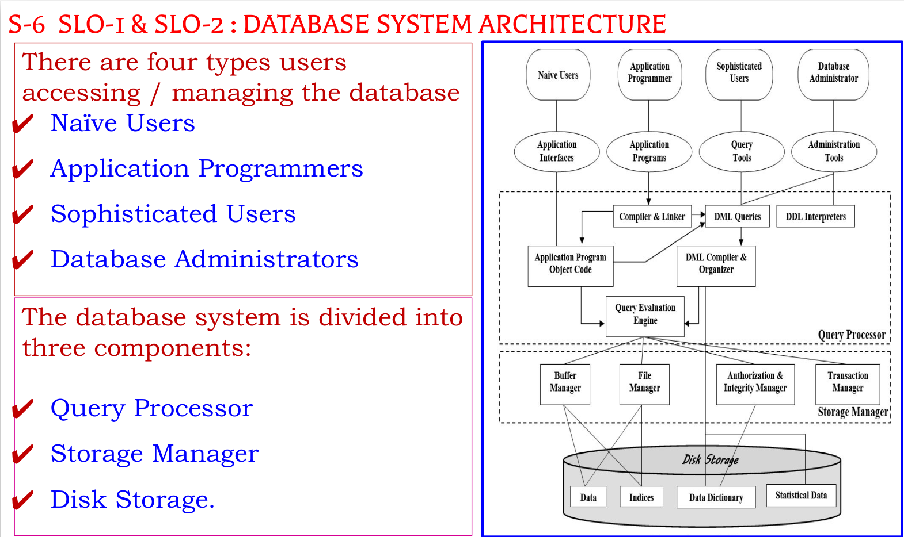

# dbms-notes-2023

DBMS IMPORTANT

## Unit 1 -

### 4 Marks

1. [Advantages of data base management  system](https://www.geeksforgeeks.org/advantages-of-dbms-over-file-system/)
2. [Data abstract](https://www.scaler.com/topics/data-abstractions-in-dbms/)
3. [Data independence](https://www.guru99.com/dbms-data-independence.html)
4. [Views of data](https://www.guru99.com/dbms-architecture.html)

### 12M Marks

1. Sql commands, architecture, database users, data independence
2. Compare file processing vs dbms, abstraction, views of data applications of dbms
3. Database Languages
4. [Database Architecture](https://www.geeksforgeeks.org/structure-of-database-management-system/) - Use PPT
   

## Unit 2 -

### 4M Marks

1. [Conversion of ER Diagrams to Tables](https://www.gatevidyalay.com/er-diagrams-to-tables/)
2. [Database Design](https://www.javatpoint.com/database-design)
3. Design Process
4. Keys , Attributes and Constraints - Use PPT

### 12M marks

1. ER Model
2. ER Diagram
3. Query Processing in DBMS
4. Mapping Cardinality
5. [Data Models](https://computenepal.com/database-model-relational-hierarchical-network-object-oriented-entity-relational-database-model-and-data-model/)

## Unit 3 -

### 4M Marks

1. Basics of SQL - DDL, DML, DCL, TCL
2. SQL Constraints
3. Aggregate Functions
4. Scalar Functions
5. Trigger
6. Transaction Control Language Commands - Commit, Rollback, Savepoint

### 12M Marks

1. Basics of SQL (Detailed and Explained)
2. Sub Queries, correlated sub queries
3. Nested Queries, views and it's types
4. Functions
5. PL/SQL Concepts - Cursors

## Unit 4 -

### 4 Marks

1. Dependencies
2. Relational Algebra

### 12 Marks

1. Normalisation - 1NF, 2NF, 3NF and BCNF

## Unit 5 -

### 4 Marks

1. [ACID](https://www.scaler.com/topics/dbms/acid-properties-in-dbms/)
2. [Locking and Two phase locking protocol](https://www.scaler.com/topics/two-phase-locking-protocol/)
3. [Transaction control](https://www.guru99.com/dbms-transaction-management.html)

### 12 Marks

1. Concurrency
2. Serializability
3. Deadlock
